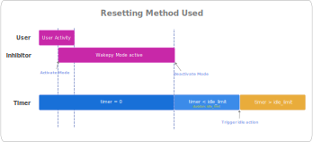
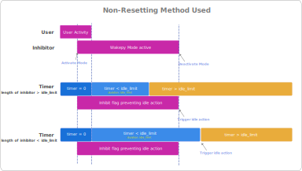
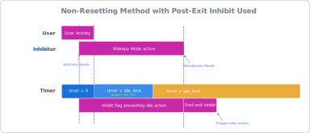

# Post Keepawake Behavior

This page documents the different types of behavior after a keepawake has been deactivated.

## Idle timers and automatic suspend
All automatic suspend behavior depends on some type of timer. In the context of wakepy it is referred as the *idle timer*. User interaction—such as mouse movement or key presses—resets it and keeps it at zero when the computer is at use.

Once the timer reaches its configured timeout, the system typically executes a suspend-related action, like sleeping or turning off the display. The system sleep and display use *separate* timers and may have different timeout limits.

## How inhibitors work?

An *inhibitor* is something that prevents an idle timeout action. While inhibitors are active, at least one of the following is true:

- The idle timer is kept at zero, either by restarting periodically or by restarting it once and freezing it.
- The idle timer continues running, but a flag suppresses the associated suspend action even if the timeout is reached.

In addition to that, the inhibitor might have a *post-exit inhibit*, which means a period of time after the inhibitor was deactivated when an *additional* inhibit flag is held.

Therefore, all inhibitors (and any wakepy Methods acting as one) can be divided into two Idle Timer Reset Types: [Resetting](#idle-timer-resetting) and [Non-Resetting](idle-timer-non-resetting), and all inhibitors might have the [Post Exit Inhibit](#post-exit-inhibit) behavior.

(idle-timer-resetting)=
### Resetting

If a wakepy Method is of *Resetting* IdleTimerResetType, the idle timer starts from zero after exiting the wakepy Mode. An example of such Method is [org.gnome.SessionManager](#org-gnome-sessionmanager) on the GNOME Desktop Environment.

:::{figure-md} img-resetting-type
{width=800px}

*Wakepy Method with Idle Timer Reset Type = Resetting*
:::

(idle-timer-non-resetting)=
### Non-Resetting
If a wakepy Method is of *Non-Resetting* IdleTimerResetType, the idle timer continues increasing during and after exiting the wakepy Mode (a flag prevents the suspend action). After exiting the wakepy Mode, the system is likely to be ready to trigger the idle action (unless the inhibitor has [Post-Exit Inhibit](#post-exit-inhibit) behavior). An example of a Method with Non-Resetting IdleTimerResetType is [SetThreadExecutionState](#windows-stes) on Windows.

:::{figure-md} img-non-resetting-type
{width=800px}

*Wakepy Method with Idle Timer Reset Type = Non-Resetting*
:::

(post-exit-inhibit)=
### Post-exit Inhibit
If a wakepy Method has Post-Exit inhibit behavior, there will be an additional inhibitor flag for a duration of the post-exit inhibitor. The duration of the Post-Inhibit flag is Non-Resetting (it does not touch the idle timer). An example of a Method with post-exit inhibit behavior is [SetThreadExecutionState](#windows-stes) on Windows 10.

:::{figure-md} img-post-exit-inhibit-type
{width=800px}

*Wakepy Method with Post Exit Inhibit. It is also of the Non-Resetting Type, but the focus here is the additional Post Exit Inhibit flag which causes the idle action to trigger later than at the Mode deactivation.*
:::

# How to test and document the behavior?

- Make your system sleep in a short time like 5 minutes. Instructions for changing the settings on some systems are included at: {ref}`how-to-test-wakepy-modes`
- Run the [scripts/example-test-with-wakepy.py](https://github.com/fohrloop/wakepy/blob/main/scripts/example-test-with-wakepy.py) (Edit the `MODE_ACTIVE_TIME` to set the *Mode Active time* if wanted). If the Mode starts with a different Method that you're trying to test, use the `methods` or `omit` [arguments](#api-reference) of the Mode.
- Wait until the system suspends. Wait about 30 seconds extra just to make sure it really did suspend. Wake up the computer.
- Check the latest timestamp before the larger delta. For example the printout below would mean that the system started suspend between 11:00 min and 11:02 min (because last timestamp is from 11:00 seconds and it's printed every 2 seconds).

```
Jul 20 21:46:39 | elapsed 0:10:52.164442 | delta: 2.000657s
Jul 20 21:46:41 | elapsed 0:10:54.164911 | delta: 2.000469s
Jul 20 21:46:43 | elapsed 0:10:56.165335 | delta: 2.000424s
Jul 20 21:46:45 | elapsed 0:10:58.166114 | delta: 2.000779s
Jul 20 21:46:47 | elapsed 0:11:00.166861 | delta: 2.000747s
Jul 20 21:47:14 | elapsed 0:11:26.799312 | delta: 26.632451s
Jul 20 21:47:16 | elapsed 0:11:28.799807 | delta: 2.000495s
```

- Testing just one time might be enough for a system. For example, if you can clearly see from the results that the Method must be of [Resetting](#idle-timer-resetting) Type. If the results are unclear, or if there is random element in the results, you might want to re-run the test with different idle timer timeout limits and with different `MODE_ACTIVE_TIME` values in the `example-test-with-wakepy.py`, and create a table, like in [#450](https://github.com/fohrloop/wakepy/issues/450#issuecomment-3074518760).
- If you have conducted a test, please open a new [issue](https://github.com/fohrloop/wakepy/issues) or comment an existing one to share the results 🙏