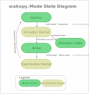
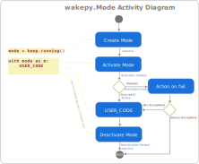
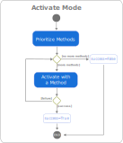
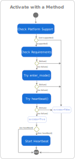

# Wakepy Mode Lifecycle

## Introduction to Modes
**Modes** are what you enter in, stay for a while, and exit from. For example, `keep.running` is a Mode where automatic suspend is inhibited.  Modes are implemented as regular [context manager](https://peps.python.org/pep-0343) classes.  A simple example of using wakepy Modes is

(simple-example-code-block)=
```{code-block} python
from wakepy import keep

with keep.running():
    USER_CODE
```

Before we talk about the Mode lifecycle, let's introduce the different states a Mode can have. There are five different states related to any wakepy Mode lifecycle. Out of them, *three* are states of the Mode class: 
- ***Inactive***: The initial state of Modes. Also the state after deactivation.
- ***Active***: Where USER_CODE is meant to be run in.
- ***Activation Failed***: Possible state if activation fails.

The two other — *Activation Started* and *Deactivation Started* — are intermediate states in the Mode activation and deactivation processes. The five states are shown in the wakepy.Mode State Diagram in {numref}`state-diagram`.
    
:::{figure-md} state-diagram
{width=500px}

*The five states related to wakepy Modes*
:::

## Overview of the Mode Lifecycle

In order to make it is easier to discuss about what is happening, we use the code from [this code block](simple-example-code-block) and  split the Mode initialization and activation in the [*context expression*](https://peps.python.org/pep-0343/#standard-terminology) into two statements and add comments and line numbers:

```{code-block} python
:lineno-start: 1
from wakepy import keep

# Returns an instance of Mode
mode = keep.running()
# Inactive 

with mode:
    # Active 
    USER_CODE
    # Still Active
    
# Inactive
```
The above comments assume "the happy path" (the mode activation succeeds). Then, we compare the code with the actions in the [Activity Diagram](#mode-activity-diagram). 

### Mode Activity Diagram


The wakepy.Mode Activity Diagram in {numref}`fig-mode-activity-diagram` shows the *Activities* related to activating, working in and deactivating a mode. The arrows on left side show how these relate to python code. The States from {numref}`state-diagram` are marked between activities in cursive font, in light blue.

:::{figure-md} fig-mode-activity-diagram
{width=660px}

*The Activity Diagram related to activating and deactivating wakepy Modes*
:::


## Creating a Mode instance

This corresponds to the action "Create Mode" in {numref}`fig-mode-activity-diagram`. When you create an instance of the wakepy Mode class with 


```{code-block} python
:emphasize-lines: 4
:lineno-start: 1

from wakepy import keep

# Returns an instance of Mode
mode = keep.running()
# Inactive 

```

the instance will initially be in the *Inactive* state.


## Activating a Mode

In order to set your system into a Mode, you need to activate it ("Activate Mode" in {numref}`fig-mode-activity-diagram`). As Modes are [context managers](https://peps.python.org/pep-0343/) it is possible to simply use:

```{code-block} python
:emphasize-lines: 3
:lineno-start: 7
mode = keep.running()

with mode:
    # Active 
    USER_CODE
```

This will put the Mode into *Active* or *Activation Failed* state through the intermediate *Activation Started* state. If the code is set to *Activation Failed* state, the *Action on Fail* occurs (See: {numref}`fig-mode-activity-diagram`). This action may be an exception or a warning.

(activating-a-mode-note)=
````{note} 
**Using mode.activate directly**:

It is also possible to call `mode.activate()` directly, but using the `with` statement is highly recommended as it makes sure that deactivation is done even if there are exceptions within the `USER_CODE`. The above `with mode:...` is roughly equal to

```{code-block} python
:emphasize-lines: 1

mode.activate()
try:
    USER_CODE
finally:
    mode.deactivate()
```

````

The {numref}`fig-activate-mode-activity-diagram` presents an activity diagram from the "Activate Mode" step of {numref}`fig-mode-activity-diagram`. The steps are:
- ***Prioritize Methods***: In this step, methods are prioritized first with `methods_priority` from the user, if given. Then, the methods are prioritized using platform support information from `Method.supported_platform`.
- ***Activate with a Method***: Try to activate the Mode using the Method with highest priority. This is explained in more detail in the [next section](#section-activating-with-a-method). Note that only *one* Method is ever used to activate a Mode; the first one which does not fail, in priority order.

This process happens in the `activate_mode` function and it returns an `ActivationResult` object, the used `wakepy.Method` instance (if successful)  and a `Heartbeat` instance (if used).

:::{figure-md} fig-activate-mode-activity-diagram
{width=430px}

*The Activity Diagram for the "Activate Mode" action of the {numref}`fig-mode-activity-diagram`.*
:::


(section-activating-with-a-method)=
### Activate with a Method

The {numref}`fig-activate-with-a-method` presents the activity diagram for the "Activate with a Method" action from the {numref}`fig-activate-mode-activity-diagram`. This is what wakepy does with the Method:


1. Checks platform support against the list in the `Method.supported_plaforms`. 
2. Checks requirements using `Method.caniuse()`. Some Methods could require a certain version of some specific Desktop Environment, a version of a 3rd party software, or some DBus service running. During this step, if some 3rd party SW has known bugs on certain versions, the Method may be dismissed.
3. Tries to activate the Mode using the `Method.enter_mode()`, if defined
4. Tries to start the heartbeat using the `Method.heartbeat()`, if defined
5. Starts the Heartbeat, if the `Method.heartbeat()` exists. This will run in a separate thread.
  
If the first two steps do not fail, at least one of `Method.enter_mode()` and `Method.caniuse()` is defined and they do not raise Exceptions, the Mode activation is successful.

:::{figure-md} fig-activate-with-a-method
{width=430px}

*The Activity Diagram for the "Activate with a Method" action of the {numref}`fig-activate-mode-activity-diagram`.*
:::


## Staying in a Mode

This part of the Mode lifecycle is where the user code ("USER_CODE" in {numref}`fig-mode-activity-diagram`) is ran. Sometimes this code could be just simple while loop with sleeps until `KeyboardInterrupt`, and sometimes it is some long-running task. During this activity, the Mode will be in *Active* or *Activation Failed* state ({numref}`state-diagram`). If the used Method has a `heartbeat()` method, it will be called every `Method.heartbeat_period` seconds in a separate heartbeat thread.

## Deactivating a Mode

The "Deactivate Mode" activity in {numref}`fig-mode-activity-diagram` occurs automatically when the `with` block is exited; between lines 10 and 11 in the code below:

```{code-block} python
:emphasize-lines: 4,5
:lineno-start: 7

with mode:
    # Active 
    USER_CODE
    # Still Active
    
# Inactive
```

This is handled automatically by the context manager. What actually is called is `Mode.__exit__()` which in turn calls `Mode.deactivate()`, which triggers deactivating the used Method. Deactivating a Method means stopping the `Method.heartbeat()` calls (if heartbeat is used) and calling `Method.exit_mode()`.

```{note}
When using the `with` statement, the context manager takes care of calling `Mode.deactivate()` if the `USER_CORE` raises an Exception. It is also possible to use `Mode.deactivate()` directly, but that is not recommended, as explained in [this Note](activating-a-mode-note) in the Activating a Mode section.
```

