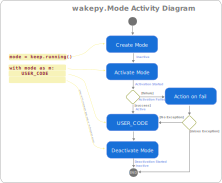

# Wakepy Modes

## What Modes are?
**Modes** are what you enter in, stay for a while, and exit from. For example, `keep.running` is a Mode where automatic suspend is inhibited.  Modes are implemented as regular [context manager](https://peps.python.org/pep-0343) classes.  A simple example of using wakepy Modes is

(simple-example-code-block)=
```{code-block} python
from wakepy import keep

with keep.running():
    USER_CODE
```


## States related to wakepy Modes

There are five  different states related to activation and deactivation of wakepy Modes. Out of them, *three* are states of the Mode class: 
- ***Inactive***: The initial state of Modes. Also the state after deactivation.
- ***Active***: Where USER_CODE is meant to be run in.
- ***Activation Failed***: Possible state if activation fails.

The two other — *Activation Started* and *Deactivation Started* — are intermediate states in the Mode activation and deactivation processes. The five states are shown in the wakepy.Mode State Diagram in {numref}`state-diagram`.
    
:::{figure-md} state-diagram
{width=500px}

*The five states related to wakepy Modes*
:::

## Wakepy Mode Lifecycle

In order to make it is easier to discuss about what is happening, we use the code from [this code block](simple-example-code-block) and  split the Mode initialization and activation in the [*context expression*](https://peps.python.org/pep-0343/#standard-terminology) into two statements and add comments and line numbers:

```{code-block} python
:lineno-start: 1
from wakepy import keep

# Returns an instance of Mode
mode = keep.running()
# Inactive 

with mode:
    # Active 
    USER_CODE
    # Still Active
    
# Inactive
```
The above comments assume "the happy path" (the mode activation succeeds). Then, we compare the code with the actions in the [Activity Diagram](#mode-activity-diagram). 

### Mode Activity Diagram


The wakepy.Mode Activity Diagram in {numref}`fig-mode-activity-diagram` shows the *Activities* related to activating, working in and deactivating a mode. The arrows on left side show how these relate to python code. The States from {numref}`state-diagram` are marked between activities in cursive font, in light blue.

:::{figure-md} fig-mode-activity-diagram
{width=660px}

*The Activity Diagram related to activating and deactivating wakepy Modes*
:::


### Creating a Mode instance

This corresponds to the action "Create Mode" in {numref}`fig-mode-activity-diagram`. When you create an instance of the wakepy Mode class with 


```{code-block} python
:emphasize-lines: 4
:lineno-start: 1

from wakepy import keep

# Returns an instance of Mode
mode = keep.running()
# Inactive 

```


the instance will initially be in the *Inactive* state.


### Activating a Mode

In order to set your system into a Mode, you need to activate it ("Activate Mode" in {numref}`fig-mode-activity-diagram`). As Modes are [context managers](https://peps.python.org/pep-0343/) it is possible to simply use:

```{code-block} python
:emphasize-lines: 3
:lineno-start: 7
mode = keep.running()

with mode:
    # Active 
    USER_CODE
```

This will put the Mode into *Active* or *Activation Failed* state through the intermediate *Activation Started* state. If the code is set to *Activation Failed* state, the sub-Action *Action on Fail* occurs (See: {numref}`fig-mode-activity-diagram`). This action may be an exception or a warning.

(activating-a-mode-note)=
````{note} 
**Using mode.activate directly**:

It is also possible to call `mode.activate()` directly, but using the `with` statement is highly recommended as it makes sure that deactivation is done even if there are exceptions within the `USER_CODE`. The above `with mode:...` is roughly equal to

```{code-block} python
:emphasize-lines: 1

mode.activate()
try:
    USER_CODE
finally:
    mode.deactivate()
```

````

### Running a long task (USER_CODE)

The "USER_CODE" in {numref}`fig-mode-activity-diagram` is the place where user will run their code, for example some long-running task. During this activity, the Mode will be in Active state.

### Deactivating a Mode

The "Deactivate Mode" activity in {numref}`fig-mode-activity-diagram` occurs automatically when the `with` block is exited; between lines 10 and 11 in the code below:

```{code-block} python
:emphasize-lines: 4,5
:lineno-start: 7

with mode:
    # Active 
    USER_CODE
    # Still Active
    
# Inactive
```

This is handled automatically by the context manager. What actually is called is `Mode.__exit__()` which in turn calls `Mode.deactivate()`. 

```{note}
When using the `with` statement, the context manager takes care of calling `Mode.deactivate()` if the `USER_CORE` raises an Exception. It is also possible to use `Mode.deactivate()` directly, but that is not recommended, as explained in [this Note](activating-a-mode-note) in the Activating a Mode section.
```