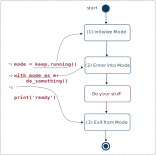

# Technical Details

This page contains more detailed explanation on how wakepy works.  You  *do not need to read this* to be able to use wakepy, but this page can be considered useful for anyone wanting to contribute to wakepy and probably somewhat interesting for the most technically oriented people.

## Wakepy Modes
**Modes** are what you enter in, stay for a while, and exit from. For example, `keep.running` is a Mode where automatic suspend is inhibited.  Modes are implemented as regular [context manager](https://peps.python.org/pep-0343) classes. They have three different phases
1. initialization 
2. entering
3. exiting 

:::{figure-md}
{w=500px}

*The three phases of wakepy Modes*
:::


### Mode initialization

The mode initialization occurs when the Mode subclass is initialized; in an expression like `SubMode()`. As it is a context manager, this class might get a lower case name for aesthetics. So, for example, the following initializes a `keep.running` mode (subclass of Mode) and stores it in a variable called `mode`:

```python
mode = keep.running()
```
Mode initialization is often included in the *[context expression](https://peps.python.org/pep-0343/#standard-terminology)*, rather than being on a separate line, like this:

```python
with {context-expression} as m:
    ...
```

for example:

```python
with keep.running() as m:
    ...
```

but initialization is still a separate step from the mode enter. 

### Entering into a mode

During the with statement, 

```
with mode as m:
    ...
```

the `__enter__` method of the context manager (*ie.* `mode.__enter__`) is called and the return value of `__enter__` is stored in `m`. In wakepy, this return value is a `ActivationResult` instance. In other words, the above is roughly the same as:

```python
m = mode.__enter__()
...
```


When entering into a Mode, a lot of things occur. One of the things is that wakepy needs to determine, from all the [***Methods***](#wakepy-methods) in `Mode.methods`, which ones can be used. There might be multiple reasons why a method could not be used
- Wrong operating system
- Wrong Desktop Environment
- Required software not found
- Wrong version of Desktop Environment or software


## Wakepy Mode Lifecycle

The Wakepy Mode lifecycle is shown in the [Figure](#fig-mode-phases) below. Everything starts with the `Mode.enter()` call in the main thread. All the `Mode.methods` are optionally prioritized using the user-supplied list of prioritized methods. Then, a new thread is spawn. Threads are needed for the support of all "heartbeat" type of methods, but they also make entering the mode faster, which is nice if there are many candidate methods available. This way user code does not need to wait at all when entering a mode.

In the new thread, suitability of each method is checked. In this phase filter out all methods that require different OS than what the code is running on. Also, use the `method.check_suitability()` to check other things. For example, some methods might require certain desktop environment or other software of certain version to be present. At this stage, possible known bugs of 3rd party software on certain versions can be acted on.


:::{figure} ./img/wakepy-mode-lifecycle.svg 
:w: 300px
:name: fig-mode-phases
:alt: wakepy mode phases

*Wakepy mode lifecycle*
:::

Then, with all the methods which are suitable or potentially suitable (`method.suitability` is not `UNSUITABLE`), try `method.enter_mode()` *and* `method.heartbeat()`. Set the `method.entered` and `method.success` attributes of each of the non-unsuitable methods. If the method implements a good `.check_suitability`, it will most probably succeed. If you wonder why the `method.heartbeat()` is called at this stage, here's the reason: that will allow different entry strategies, like: *use just first successful method* or *use N first successful methods* in addition to the *use all possible methods*.

Then is the first possible moment to communicate back to the main thread (to ModeManager) the end result of the mode activation: Did it succeed? Which methods were used? Etc. So that is done here. If any properties/methods of `ModeManager` requiring this information are accessed in the Main Thread before this information is available, that function call *blocks* until the information is available.

After communication to the main thread, the worker thread will 
- if there are any successful methods using heartbeat, start the heartbeat loop
- if there are no successful methods using heartbeat, but `enter_mode()`, just *block* and wait until user exits the mode (zero resource usage)
- if all methods failed, simply exit.

When the context manager is exited, a `EXIT` command is automatically sent from main thread to the worker thread, which either exits the heartbeat loop or stops the wait (depending on the state), and exits with `method.exit_mode()` using all the active methods.  After this, the thread terminates.

(wakepy-methods)=
## Wakepy Methods

**Methods** are different ways of entering/keeping in a Mode. A Method may support one or more operating systems, and may have one or more requirements for software it should be able to talk to or execute. For example, on Linux. using the Inhibit method of the [org.gnome.SessionManager](https://lira.no-ip.org:8443/doc/gnome-session/dbus/gnome-session.html) D-Bus service is one way of entering `keep.running` mode, and it required D-Bus and (a certain version of) GNOME. 

